# 📊 فلو جارت شامل للمشروع

## 🎯 نظرة عامة على النظام

```
┌─────────────────────────────────────────────────────────────┐
│                    نظام إدارة المطعم                         │
│              Restaurant Management System                    │
└─────────────────────────────────────────────────────────────┘
```

---

## 1️⃣ تدفق المصادقة (Authentication Flow)

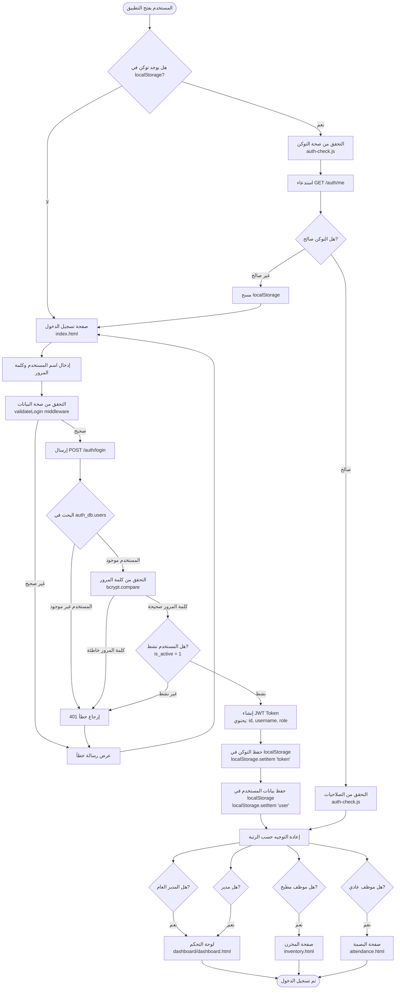

---

## 2️⃣ تدفق التفويض والصلاحيات (Authorization Flow)

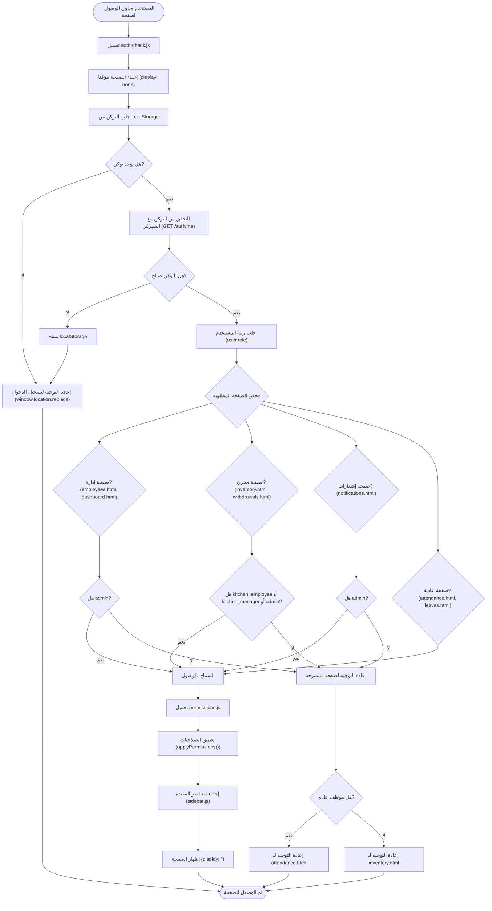

---

## 3️⃣ تدفق إدارة الموظفين (Employee Management Flow)

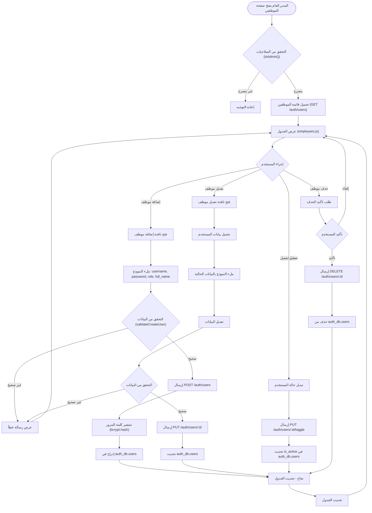

---

## 4️⃣ تدفق طلبات الإجازات (Leave Requests Flow)

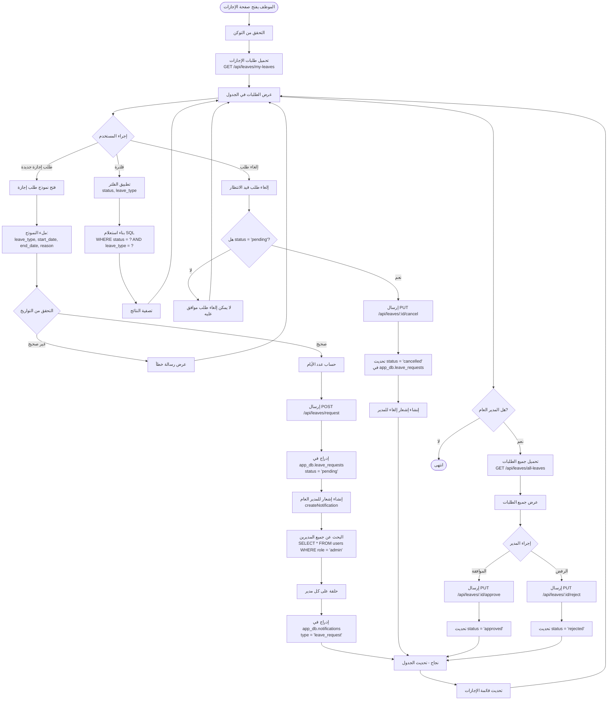

---

## 5️⃣ تدفق إدارة المخزن (Inventory Management Flow)

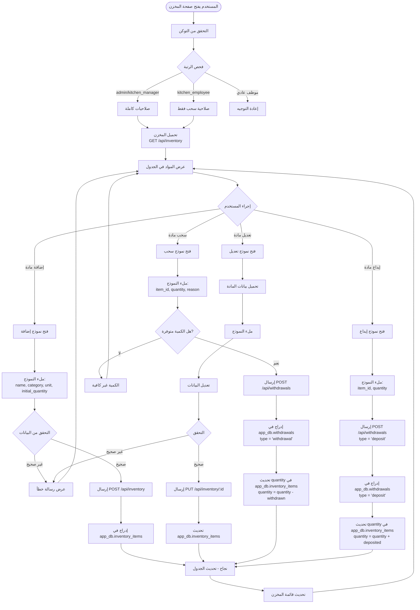

---

## 6️⃣ تدفق إدارة الهدر (Waste Management Flow)

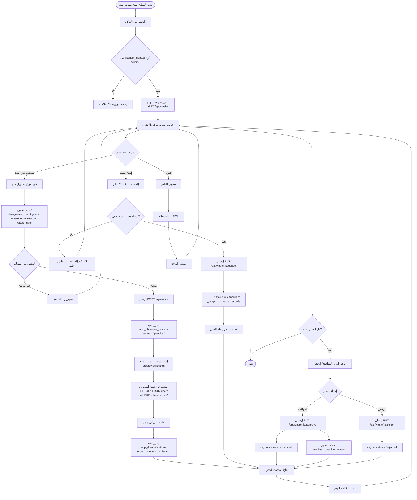

---

## 7️⃣ تدفق الإشعارات (Notifications Flow)

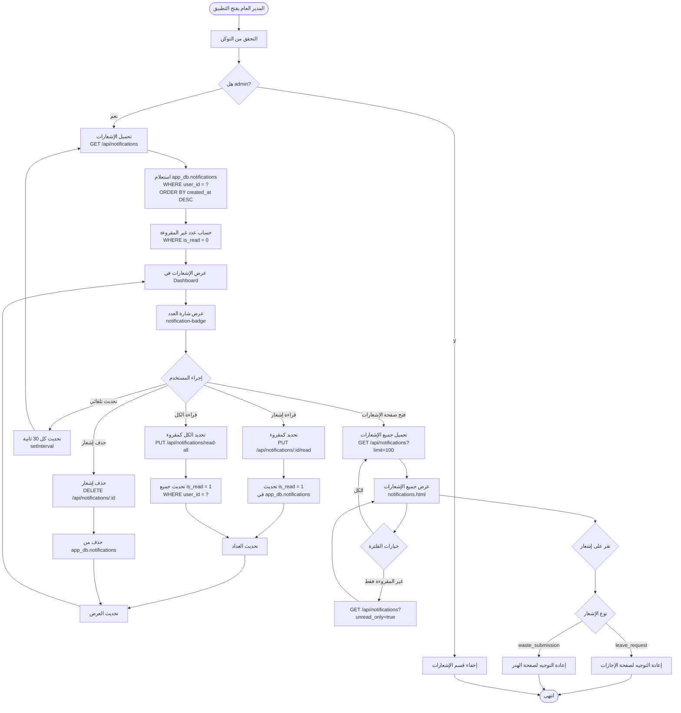

---

## 8️⃣ تدفق إنشاء الإشعارات (Notification Creation Flow)

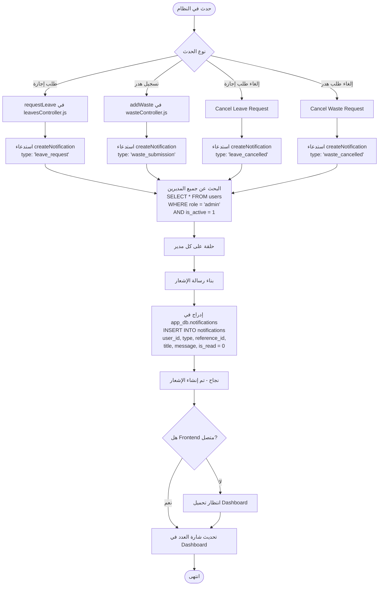

---

## 9️⃣ تدفق الصلاحيات حسب الرتب (Role-Based Permissions Flow)

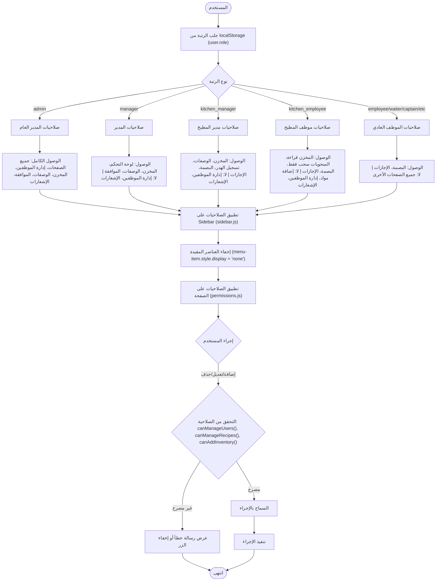

---

## 🔟 تدفق البصمة (Attendance Flow)

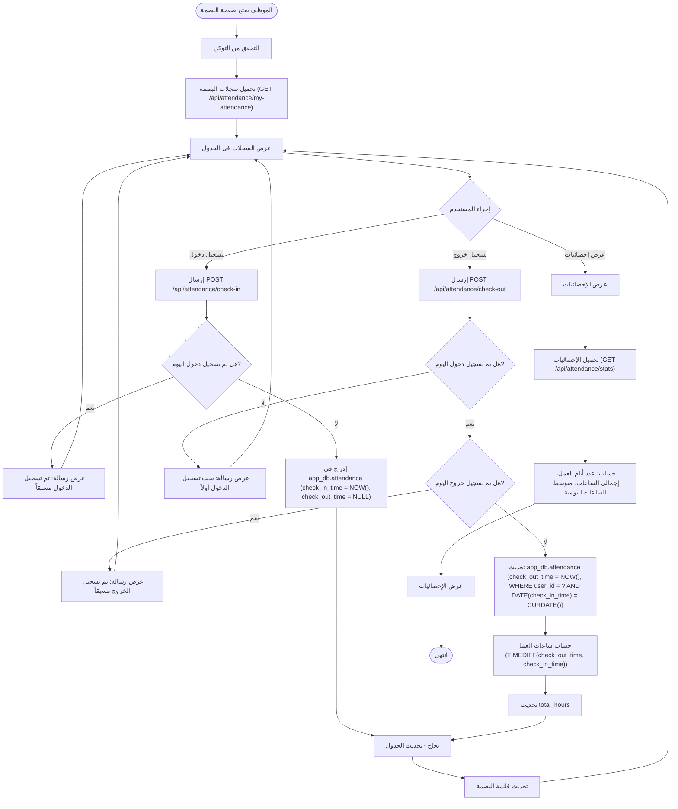

---

## 1️⃣1️⃣ تدفق الوصفات (Recipes Flow)

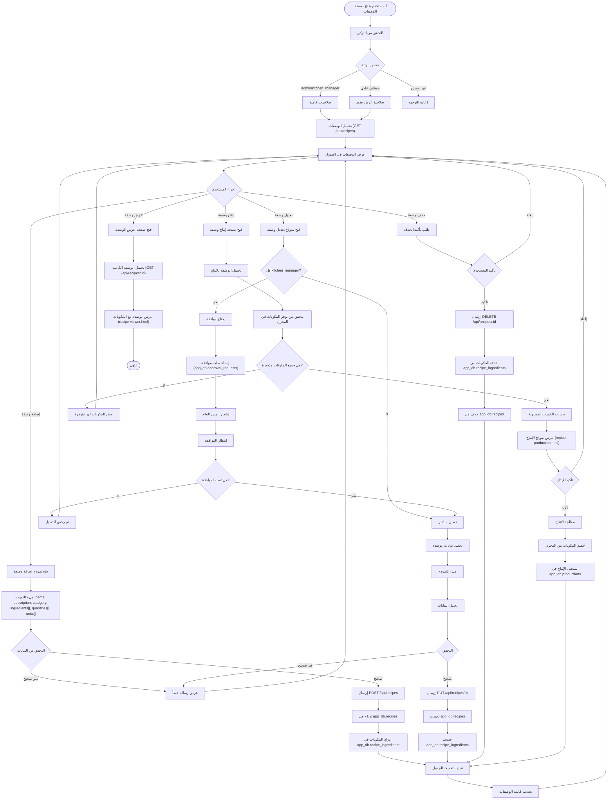

---

## 1️⃣2️⃣ تدفق قاعدة البيانات (Database Flow)

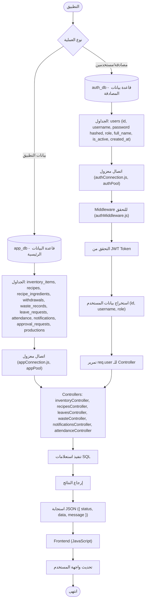

---

## 📋 ملخص الصلاحيات حسب الرتب

| الرتبة | البصمة | الإجازات | المخزن | السحوبات | الوصفات | الهدر | الموظفين | الإشعارات | لوحة التحكم |
|--------|--------|----------|--------|----------|---------|-------|----------|-----------|-------------|
| **admin** | ✅ | ✅ | ✅ | ✅ | ✅ | ✅ | ✅ | ✅ | ✅ |
| **manager** | ✅ | ✅ | ✅ | ✅ | ✅ | ✅ | ❌ | ❌ | ✅ |
| **kitchen_manager** | ✅ | ✅ | ✅ | ✅ | ✅ | ✅ | ❌ | ❌ | ❌ |
| **kitchen_employee** | ✅ | ✅ | 👁️ (قراءة) | ✅ (سحب فقط) | ❌ | ❌ | ❌ | ❌ | ❌ |
| **employee** | ✅ | ✅ | ❌ | ❌ | ❌ | ❌ | ❌ | ❌ | ❌ |
| **waiter/captain/etc** | ✅ | ✅ | ❌ | ❌ | ❌ | ❌ | ❌ | ❌ | ❌ |

---

## 🔄 تدفق الأخطاء (Error Handling Flow)

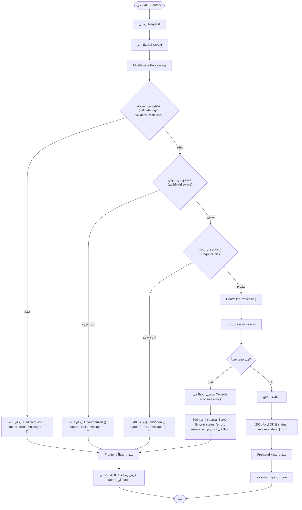

---

## 📝 ملاحظات مهمة

1. **عزل قواعد البيانات**: 
   - `auth_db` منفصلة تماماً عن `app_db`
   - كل قاعدة بيانات لها اتصال منفصل (authPool, appPool)

2. **الأمان**:
   - جميع كلمات المرور مشفرة بـ bcrypt
   - JWT Tokens مع انتهاء صلاحية
   - التحقق من الصلاحيات في كل طلب

3. **الإشعارات**:
   - يتم إنشاؤها تلقائياً عند حدوث أحداث معينة
   - فقط المدير العام يرى الإشعارات

4. **الصلاحيات**:
   - يتم التحقق منها في Frontend (auth-check.js, permissions.js)
   - يتم التحقق منها في Backend (authMiddleware, requireRole)

5. **التحديث التلقائي**:
   - الإشعارات في Dashboard تتحدث كل 30 ثانية
   - يمكن تحديث البيانات يدوياً

---

## 🎯 الخلاصة

هذا النظام يوفر:
- ✅ نظام مصادقة وتفويض قوي
- ✅ إدارة شاملة للموظفين
- ✅ تتبع الإجازات والهدر
- ✅ إدارة المخزن والوصفات
- ✅ نظام إشعارات للمدير العام
- ✅ صلاحيات محددة حسب الرتب
- ✅ واجهة مستخدم سهلة الاستخدام

---

**تم إنشاء هذا الفلو جارت بواسطة:** AI Assistant  
**التاريخ:** 2024  
**الإصدار:** 1.0

